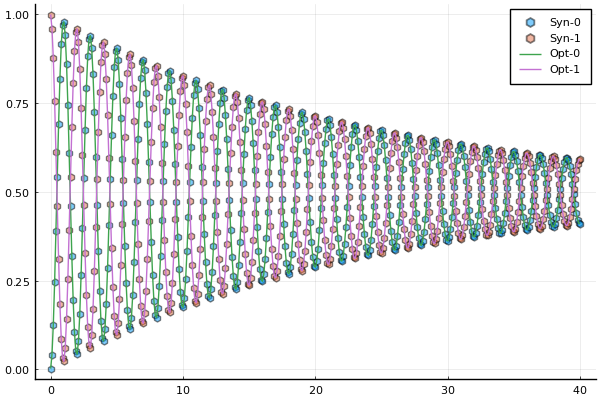
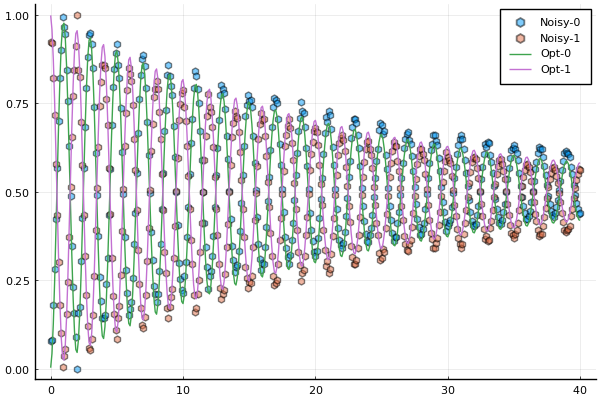

## Example 1: characterization of a single qubit Ramsey experiment 
In this example, we characterize a single qubit usnig synthetic data of a [Ramsey experiment](experiment.md). Specifically, we  find the transition frequency $\omega_{01}$ and the dephasing time $T_2=1/\gamma_2$.

We first consider a synthetic data set without noise.
The code can be executed by issuing the commands (from the root `GLOQ.jl` directory) `cd("examples");include("SingleQubitRamsey.jl")`. The code snippets below are from that file. 

### Step 1: generate the synthetic data
We first set up the system parameters. The number of states is `N_states=2` for the single qubit. `freqs, gamma1, gamma2` are vectors holding the transition frequency, the reciprocal of the relaxation time and the reciprocal of the dephasing time. The unit for these parameters are `GHz`.

```julia
# System parameters for a simple two level open quantum system
N_states = 2; # number of states
freqs = [4.1] # transition frequency in GHz
omegas = 2.0*pi.*freqs # change to angular frequency
gamma1   = [1.0/(55.0*GLOQ.GLOQ_MICRO_SEC)] # Reciprocal of relaxation time - T1 (in units of ns)
gamma2   = [1.0/(15.0*GLOQ.GLOQ_MICRO_SEC)] # Reciprocal of dephasing time - T2 (in units of ns)
omr = 2.0*pi*(4.1 - 5.0e-4) # drive frequency
TC = 2.5*17.0 # total control time in ns needed for a Rabi pulse, check the page of experiments for more details 
```
Initial state vector is $$\mathcal{s}=(1,0)^T+i(0,0)^T$$. In other words, the initial density matrix is 
$$\rho=\mathcal{s}\mathcal{s}^\dagger=\left(\begin{matrix}
1 & 0\\
0 & 0
\end{matrix}\right).$$
```julia
# Initial state
initial_state = 0
state_u0 = [0.0;0.0]
state_v0 = [0.0;0.0]
state_u0[initial_state+1] = 1.0
```
The duration of the Ramsey experiment is 40.0 $\mu s$, is discretized into 401 equidistant dark times.
```julia
# Duration of the Ramsey experiment, largest dark time given in Microseconds
T_Ramsey = 40.0*GLOQ.GLOQ_MICRO_SEC # convert micro-sec to nano-sec
# total number of dark time samples
N_dark_times = 401
t_dark_times = collect(range(0.0, T_Ramsey, length=N_dark_times))
```
Use `GLOQ.RamseyForwardSolve` to perform a forward solve to generate the 
synthetic data of the Ramsey experiment. 
```julia
# Forward solve to generate synthetic data
rho_synthetic_ramsey_u,rho_synthetic_ramsey_v = GLOQ.RamseyForwardSolve(
				 state_u0,state_v0, # initial values, u for the real part, v for the imaginary part
				 omegas,omr, # transition frequencies, drive frequency
				 gamma1,gamma2, # decay and dephasing parameters 
				 initial_state, # initial state
				 TC,t_dark_times,N_states) # control time, dark time, total number of states
```
Use `GLOQ.get_population` to compute the population based on the real part of the density matrix which is flattend and saved as a vector `rho_synthetic_ramsey_u`.
```julia
population_synthetic = GLOQ.get_population(rho_synthetic_ramsey_u)
```
### Step 2: define the objective function, initial guess and optimization bounds
#### Step 2a: define the cost objective function. Here, we use the normalized l2-mismatch. 

Suppose the number of dark times in the Ramsey experiment to be $N_{\textrm{Dark}}$. The objective function (`loss` in the code) is defined as 
```math
\big|\big| \textrm{Forward Solve Results}-\textrm{Synthetic Data}\big|\big|_2^2/N_{\textrm{Dark}},
```
with $||\cdot||_2$ being the standard $l_2$ norm.

In the objective function `loss(p,dummy_parameter)`, the first argument `p` saves the target parameter $$(\omega_{01},\gamma_2)$$ and the second argument `dummy_parameter` is needed by the optimization interface `GalacticOptim` which can be simply set up 
as `[]`. 
```julia
# Define the loss function for the GalacticOptim
# p: phyiscal parameters:
#	 p[1] = transition frequency in GHz
#	 p[2] = gamma2
# dummy_parameter: needed by GalacticOptim, one can just put [] here
function loss(p,dummy_parameter)
	_rho_ramsey_u,_rho_ramsey_v = GLOQ.RamseyForwardSolve(state_u0,state_v0,
					 (2*pi).*[p[1]],omr,
					 gamma1,[p[2]],#gamma1,gamma2,
					 initial_state, # initial state
					 TC,t_dark_times,N_states)
	_population_ramsey = GLOQ.get_population(_rho_ramsey_u)

	_loss = sum(abs2,_population_ramsey-population_synthetic)/N_dark_times
	return _loss
end
```
#### Step 2b: define a callback function to plot while optimizing
```julia
plot_callback = function(p,other_args)
	rho_ramsey_u,rho_ramsey_v = GLOQ.RamseyForwardSolve(state_u0,state_v0,
					 (2*pi).*[p[1]],omr,
					 gamma1,[p[2]],#gamma1,gamma2,
					 initial_state, # initial state
					 TC,t_dark_times,N_states)
	population_ramsey = GLOQ.get_population(rho_ramsey_u)
	fig=plot(t_dark_times./GLOQ.GLOQ_MICRO_SEC,population_synthetic,label=["Syn-0" "Syn-1"],
			 line = (:dash,0.0), marker = ([:hex :hex], 5, 0.5)  )
	plot!(fig,t_dark_times./GLOQ.GLOQ_MICRO_SEC,population_ramsey,label=["Opt-0" "Opt-1"]
		 )			
	display(fig)
    return false
end
```
#### Step 2c: Initial guess and bounds for the optimization
```julia
p_true = [freqs;gamma2] # values to generate synthetic data
# initial guess for the optimization
p_initial = [freqs .- 0.5e-4;0.9.*gamma2]

# bounds for the optimization
lower_bound = (0.5).*p_true
upper_bound = (1.5).*p_true
```
### Step 3: solve the optimization problem
#### Step 3a: define the optimization object. 
The first argument of `GalacticOptim.OptimizationFunction` is the objective function, and the second argument specifies how the gradient will be computed. Here, the auto-differentiation package [`Zygote.jl`](https://fluxml.ai/Zygote.jl/latest/) is used. Other options and settings can be found in [GalaticOptim.OptimizationFunction](https://galacticoptim.sciml.ai/stable/API/optimization_function/).
```julia
# construct optimization object, use Zygote auto-differentiation to compute the gradient
loss_gradient = GalacticOptim.OptimizationFunction(loss, GalacticOptim.AutoZygote())
opt_prob = GalacticOptim.OptimizationProblem(loss_gradient, p_initial,
					lb = lower_bound, ub = upper_bound)
```
#### Step 3b: solve the optimization problem with [GalacticOptim.solve](https://galacticoptim.sciml.ai/stable/API/solve/). 

Here, we use the `Optim.jl` and `NLopt.jl` interface of `GalacticOptim.jl`. Other available optimizer packages and more optimizer specific options are documented in [GalacticOptim.jl](https://galacticoptim.sciml.ai/stable). 

Use the `fminbox` of `Optim.jl` as the optimizer.
```julia
println("Optim Fminbox(LBFGS) Optimization starts")
@time sol = GalacticOptim.solve(opt_prob ,Fminbox(LBFGS()),
			cb = plot_callback,
			outer_iterations = 20,
			iterations = 10,
			show_trace=true,
			f_tol = 1e-10,
			outer_f_tol = 1e-10)
println("Optim Fminbox(LBFGS) Optimization done")
```
Use the `LBFGS` of `NLopt.jl` as the optimizer.
```julia
println("NLopt LBFGS Optimization starts")
@time sol_nlopt_LBFGS = GalacticOptim.solve(opt_prob, Opt(:LD_LBFGS,length(p_initial)),
			maxiters=200,
			cb = plot_callback,
			ftol_rel=1e-7)
println("NLopt LBFGS Optimization done")
```
#### Step 3c: present the result
```julia
# present the solutions
println("\nOptimized results: ",sol.u,
        "\nLoss: ",sol.minimum,
		"\nError: ",sol.u-p_true)
```
```
Optimized results: [4.099, 6.666666666665127e-5]
Loss: 8.029671826634274e-28
Error: [-0.0009999999999994458, -1.5395670849294163e-17]
```


##### Comparison of the synthetic data and the forward solve results of optimized parameter values. Population of different states are presented. 
- Syn-0: synthetic data for the energy level 0; 
- Syn-1: synthetic data for the energy level 1; 
- Opt-0: optimized result for the energy level 0; 
- Opt-1: optimized result for the energy level 1.

### The same procedure can be applied to characterize the single qubit with noisy synthetic data of a Ramsey experiment.
Check `examples/SingleQubitRamseyWithNoise.jl` for more details. The corresponding results are as follow.
```
Optimized results: [4.0999999983533915, 7.229921553726332e-5]
Loss: 0.0015030181815031656
Error: [-1.6466081831367774e-9, 5.632548870596654e-6]
```

##### Comparison of the noisy data and the forward solve results of optimized parameter values. Population of different states are presented. 
- Noisy-0: noisy data for the energy level 0; 
- Noisy-1: noisy data for the energy level 1; 
- Opt-0: optimized result for the energy level 0; 
- Opt-1: optimized result for the energy level 1.
