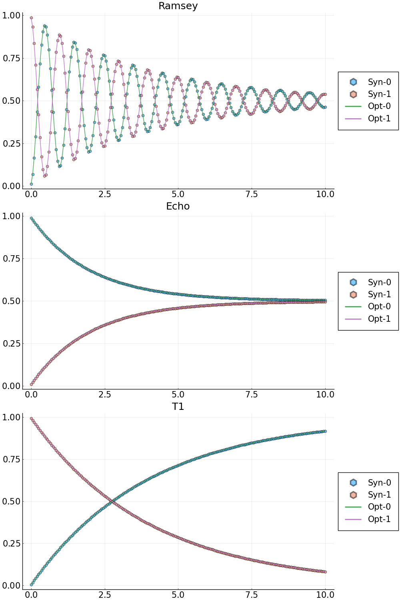

## Example 2: characterization of the Ramsey experiment, Echo experiment and T1-decay experiment with single qudit
### Step 1: generate the synthetic data
```
# System parameters for a simple two level open quantum system
N_states = 2; # number of states
freqs = [4.1] # transition frequency in GHz
omegas = 2.0*pi.*freqs # change to angular frequency
gamma1   = [25e-05] # decay
gamma2   = [25e-05] # dephasing
omr_ramsey = 2.0*pi*(4.1 - 1.0e-3) # drive frequency for the Ramsey experiment
omr_echo = 2.0*pi*4.1  # drive frequency for the Echo experiment
omr_t1 = 2.0*pi*4.1  # drive frequency for the T1 experiment
TC = 2.5*17.0 # total control time

# Initial state
initial_state = 0
rho_u0 = [0.0;0.0]
rho_v0 = [0.0;0.0]
rho_u0[initial_state+1] = 1.0

# Duration of the Ramsey experiment, largest dark time
T_Ramsey = 10.0*GLOQ.GLOQ_MICRO_SEC # convert micro-sec to nano-sec
# total number of dark time samples
N_dark_times = 201
t_dark_times = collect(range(0.0, T_Ramsey, length=N_dark_times))

```
#### Forward solve to generate synthetic data
#### Ramsey experiment 
```
rho_synthetic_ramsey_u,rho_synthetic_ramsey_v = GLOQ.RamseyForwardSolve(
				 rho_u0,rho_v0, # initial values, u for the real part, v for the imaginary part
			     omegas,omr_ramsey, # transition frequencies, drive frequency
				 gamma1,gamma2, # decay and dephasing 
				 initial_state, # initial state
				 TC,t_dark_times,N_states) # control time, dark time, total number of states
population_ramsey_synthetic = GLOQ.get_population(rho_synthetic_ramsey_u)
```
#### Echo experiment 
```
rho_synthetic_echo_u,rho_synthetic_echo_v = GLOQ.EchoForwardSolve(
				 rho_u0,rho_v0, # initial values, u for the real part, v for the imaginary part
			     omegas,omr_echo, # transition frequencies, drive frequency
				 gamma1,gamma2, # decay and dephasing 
				 initial_state, # initial state
				 TC,t_dark_times,N_states) # control time, dark time, total number of states
population_echo_synthetic = GLOQ.get_population(rho_synthetic_echo_u)
```
#### T1-decay experiment 
```
rho_synthetic_t1_u,rho_synthetic_t1_v = GLOQ.T1ForwardSolve(
				 rho_u0,rho_v0, # initial values, u for the real part, v for the imaginary part
			     omegas,omr_t1, # transition frequencies, drive frequency
				 gamma1,gamma2, # decay and dephasing 
				 initial_state, # initial state
				 TC,t_dark_times,N_states) # control time, dark time, total number of states
population_t1_synthetic = GLOQ.get_population(rho_synthetic_t1_u)

```
### Step 2: define the loss (objective) function, initial guess and optimization bounds
#### Step 2a: define the loss (objective) function. Here, we use the normalized l2-mismatch.
```
# Define the loss function for the GalacticOptim
# p: phyiscal parameters:
#	 p[1] = transition frequency in GHz
#    p[2] = gamma1
#    p[3] = gamma2
# dummy_parameter: needed by GalacticOptim, one can just put [] here
function loss(p,dummy_parameter)
	# Ramsey
	_rho_ramsey_u,_rho_ramsey_v = GLOQ.RamseyForwardSolve(rho_u0,rho_v0,
				     (2*pi).*[p[1]],omr_ramsey,
					 [p[2]],[p[3]],#gamma1,gamma2,
					 initial_state, # initial state
					 TC,t_dark_times,N_states)
	_population_ramsey = GLOQ.get_population(_rho_ramsey_u)
	# Echo
    _rho_echo_u,_rho_echo_v = GLOQ.EchoForwardSolve(rho_u0,rho_v0,
				     (2*pi).*[p[1]],omr_echo,
					 [p[2]],[p[3]],#gamma1,gamma2,
					 initial_state, # initial state
					 TC,t_dark_times,N_states)
	_population_echo = GLOQ.get_population(_rho_echo_u)
	# T1
    _rho_t1_u,_rho_t1_v = GLOQ.T1ForwardSolve(rho_u0,rho_v0,
				     (2*pi).*[p[1]],omr_t1,
					 [p[2]],[p[3]],#gamma1,gamma2,
					 initial_state, # initial state
					 TC,t_dark_times,N_states)
	_population_t1 = GLOQ.get_population(_rho_t1_u)

	_loss = ( sum(abs2,_population_ramsey-population_ramsey_synthetic)+
			  sum(abs2,_population_echo-population_echo_synthetic)+
			  sum(abs2,_population_t1-population_t1_synthetic) )/N_dark_times
		
	return _loss#,_population_ramsey
end

```
#### Step 2b: define a callback function to plot while optimizing
```
plot_callback = function(p,other_args)
	# Ramsey
	rho_ramsey_u,rho_ramsey_v = GLOQ.RamseyForwardSolve(rho_u0,rho_v0,
					 (2*pi).*[p[1]],omr_ramsey,
					 [p[2]],[p[3]],#gamma1,gamma2,
					 initial_state, # initial state
					 TC,t_dark_times,N_states)
	population_ramsey = GLOQ.get_population(rho_ramsey_u)
	# Echo
    rho_echo_u,rho_echo_v = GLOQ.EchoForwardSolve(rho_u0,rho_v0,
				     (2*pi).*[p[1]],omr_echo,
					 [p[2]],[p[3]],#gamma1,gamma2,
					 initial_state, # initial state
					 TC,t_dark_times,N_states)
	population_echo = GLOQ.get_population(rho_echo_u)

	# T1
    rho_t1_u,rho_t1_v = GLOQ.T1ForwardSolve(rho_u0,rho_v0,
				     (2*pi).*[p[1]],omr_t1,
					 [p[2]],[p[3]],#gamma1,gamma2,
					 initial_state, # initial state
					 TC,t_dark_times,N_states)
	population_t1 = GLOQ.get_population(rho_t1_u)

	# Plot
	# Ramsey
	fig_ramsey = plot(t_dark_times./GLOQ.GLOQ_MICRO_SEC,population_ramsey_synthetic,label=["Syn-0" "Syn-1"],
			          line = (:dash,0.0), marker = ([:hex :hex], 5, 0.5),legend=:outerright,
					  title="Ramsey");
	plot!(fig_ramsey,t_dark_times./GLOQ.GLOQ_MICRO_SEC,population_ramsey,label=["Opt-0" "Opt-1"],legend=:outerright);
	# Echo
	fig_echo = plot(t_dark_times./GLOQ.GLOQ_MICRO_SEC,population_echo_synthetic,label=["Syn-0" "Syn-1"],
		  		     line = (:dash,0.0), marker = ([:hex :hex], 5, 0.5),legend=:outerright,
					 title="Echo");
	plot!(fig_echo,t_dark_times./GLOQ.GLOQ_MICRO_SEC,population_echo,label=["Opt-0" "Opt-1"],legend=:outerright);		
	# T1
	fig_t1=plot(t_dark_times./GLOQ.GLOQ_MICRO_SEC,population_t1_synthetic,label=["Syn-0" "Syn-1"],
			    line = (:dash,0.0), marker = ([:hex :hex], 5, 0.5),legend=:outerright,
				title="T1");
	plot!(fig_t1,t_dark_times./GLOQ.GLOQ_MICRO_SEC,population_t1,label=["Opt-0" "Opt-1"],legend=:outerright);

	display( plot(fig_ramsey,fig_echo,fig_t1,layout=grid(3,1),size=[1000,1500],
				  legendfontsize=15,xtickfontsize=15,ytickfontsize=15,titlefontsize=18) )
	return false
end

```
#### Step 2c: define the initial guess for the optimization
```
p_true = [freqs;gamma1;gamma2] # values to generate synthetic data
# initial guess for the optimization
p_initial = [freqs.-2e-4;0.75.*gamma1;1.25.*gamma2]
# bounds for the optimization
lower_bound = (0.5).*p_true
upper_bound = (1.5).*p_true

```
### Step 3: solve the optimization problem
#### Step 3a: define the optimization object (objective function and its gradient)
```
# construct optimization object, use Zygote auto-differentiation to compute the gradient
loss_gradient = GalacticOptim.OptimizationFunction(loss, GalacticOptim.AutoZygote())
opt_prob = GalacticOptim.OptimizationProblem(loss_gradient, p_initial,
										 lb = lower_bound, ub = upper_bound)


```
#### Step 3b: solve the optimization problem with the Optim interface of GalacticOptim
```
println("Optim Fminbox(LBFGS) Optimization starts")
@time sol = GalacticOptim.solve(opt_prob ,Fminbox(LBFGS()),
								cb = plot_callback,
								outer_iterations = 20,
								iterations = 10,
								show_trace=true,
								f_tol = 1e-3,
								outer_f_tol = 1e-3)
println("Optim Fminbox(LBFGS) Optimization done")

```
#### Step 3c: presnet the result
```
println("\nOptimized results: ",sol.u,
        "\nLoss: ",sol.minimum,
		"\nError: ",sol.u-p_true)

```
#### Optimized results v.s. Synthetic data

