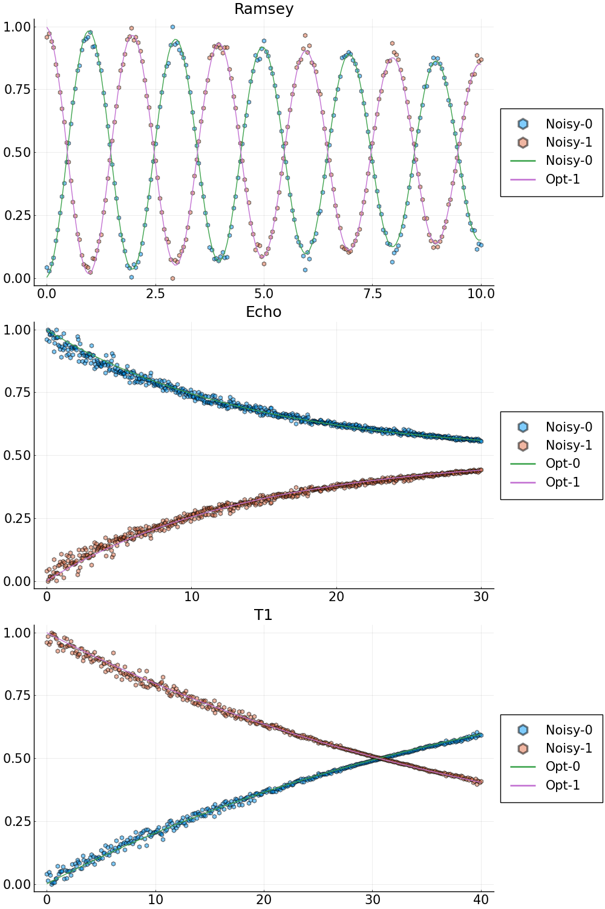

## Example 2: characterization of single qubit Ramsey experiment, Echo experiment and T1-decay experiment.
In this example, we solve a single qubit characterization problem based on the synthetic data of a  Ramsey experiment, an Echo experiment and a T1-decay experiment. We seek the relaxation time $T_1=1/\gamma_1$, the dephasing time $T_2=1/\gamma_2$ and the transition frequency $\omega_{01}$. We first consider the synthetic data without noise.
The code can be ran by `cd("examples");include("SingleQubitBayesian.jl")`. 

### Step 1: generate the synthetic data
Set up system parameters and the initial state vectors.
```julia
# System parameters for a simple two level open quantum system
N_states = 2; # number of states
freqs = [4.1] # transition frequency in GHz
omegas = 2.0*pi.*freqs # change to angular frequency
gamma1   = [1.0/(45.0*GLOQ.GLOQ_MICRO_SEC)] # Reciprocal of relaxation time - T1 (in units of ns)
gamma2   = [1.0/(24.0*GLOQ.GLOQ_MICRO_SEC)] # Reciprocal of dephasing time - T2 (in units of ns)
omr_ramsey = 2.0*pi*(4.1 - 5.0e-4) # drive frequency for the Ramsey experiment
omr_echo = 2.0*pi*4.1  # drive frequency for the Echo experiment
omr_t1 = 2.0*pi*4.1  # drive frequency for the T1 experiment
TC = 2.5*17.0 # total control time

# Initial state
initial_state = 0
state_u0 = [0.0;0.0]
state_v0 = [0.0;0.0]
state_u0[initial_state+1] = 1.0

```
#### Forward solve to generate synthetic data
Set up the duration and dark time samples of the Ramsey experiment.
```julia
# Forward solve to generate synthetic data for the Ramsey experiment
# Duration of the Ramsey experiment, largest dark time
T_Ramsey = 10.0*GLOQ.GLOQ_MICRO_SEC # convert micro-sec to nano-sec
# total number of dark time samples
N_dark_ramsey = 201
# Step size of the Ramsey experiment
dt_ramsey = T_Ramsey/N_dark_ramsey
t_dark_ramsey = collect(range(0.0, T_Ramsey, length=N_dark_ramsey))
```
Generate the synthetic data of the Ramsey experiment with `GLOQ.RamseyForwardSolve`.
```julia
# Forward solve
rho_synthetic_ramsey_u,rho_synthetic_ramsey_v = GLOQ.RamseyForwardSolve(
				 state_u0,state_v0, # initial values, u for the real part, v for the imaginary part
			     omegas,omr_ramsey, # transition frequencies, drive frequency
				 gamma1,gamma2, # decay and dephasing 
				 initial_state, # initial state
				 TC,t_dark_ramsey,N_states) # control time, dark time, total number of states
population_ramsey_synthetic = GLOQ.get_population(rho_synthetic_ramsey_u)
```
Set up the duration and dark time samples of the Echo experiment.
```julia
# Echo experiment
# Duration of the Echo experiment, largest dark time
T_Echo = 30.0*GLOQ.GLOQ_MICRO_SEC # convert micro-sec to nano-sec
# total number of dark time samples
N_dark_echo = 601
# Step size of the Echo experiment
dt_echo = T_Echo/N_dark_echo
```
Generate the synthetic data of the Echo experiment with `GLOQ.EchoForwardSolve`.
```julia
rho_synthetic_echo_u,rho_synthetic_echo_v = GLOQ.EchoForwardSolve(
				 state_u0,state_v0, # initial values, u for the real part, v for the imaginary part
			     omegas,omr_echo, # transition frequencies, drive frequency
				 gamma1,gamma2, # decay and dephasing 
				 initial_state, # initial state
				 TC,t_dark_echo,N_states) # control time, dark time, total number of states
population_echo_synthetic = GLOQ.get_population(rho_synthetic_echo_u)
```
Set up the  the T1 experiment.
```julia
# T1
# Duration of the T1-decay experiment, largest dark time
T_t1 = 40.0*GLOQ.GLOQ_MICRO_SEC # convert micro-sec to nano-sec
# total number of dark time samples
N_dark_t1 = 401
# Step size of the T1 experiment
dt_t1 = T_t1/N_dark_t1
t_dark_t1 = collect(range(0.0, T_t1, length=N_dark_t1))
```
Generate the synthetic data of the T1 experiment with `GLOQ.T1ForwardSolve`.
```julia
rho_synthetic_t1_u,rho_synthetic_t1_v = GLOQ.T1ForwardSolve(
				 state_u0,state_v0, # initial values, u for the real part, v for the imaginary part
			     omegas,omr_t1, # transition frequencies, drive frequency
				 gamma1,gamma2, # decay and dephasing 
				 initial_state, # initial state
				 TC,t_dark_t1,N_states) # control time, dark time, total number of states
population_t1_synthetic = GLOQ.get_population(rho_synthetic_t1_u)

```
### Step 2: define the objective function, initial guess and optimization bounds
#### Step 2a: define the objective function. Here, we use the normalized l2-mismatch.

Suppose the number of dark times in the Ramsey experiment to be $N_{\textrm{Dark}}$. The objective function is defined as 
```math
\begin{align*}
	 &\Delta t_{\textrm{Ramsey}}\big|\big| \textrm{Forward Solve Ramsey Results}-\textrm{Synthetic Ramsey Data}\big|\big|_2^2\\
	+&\Delta t_{\textrm{Echo}}\big|\big| \textrm{Forward Solve Echo Results}-\textrm{Synthetic Echo Data}\big|\big|_2^2\\
	+&\Delta t_{T_1}\big|\big| \textrm{Forward Solve T1-decay Results}-\textrm{Synthetic T1-decay Data}\big|\big|_2^2
\end{align*}
```
with $||\cdot||_2$ being the $l_2$-norm, $\Delta t_{\textrm{Ramsey}}$ is the time step size of the Ramsey experiment, $\Delta t_{\textrm{Echo}}$ is the time step size of the Echo experiment, and $\Delta t_{T_1}$ is the time step size of the $T_1$-decay experiment.
```julia
# Define the loss function for the GalacticOptim
# p: phyiscal parameters:
#	 p[1] = transition frequency in GHz
#    p[2] = gamma1
#    p[3] = gamma2
# dummy_parameter: needed by GalacticOptim, one can just put [] here
function loss(p,dummy_parameter)
	# Ramsey
	_rho_ramsey_u,_rho_ramsey_v = GLOQ.RamseyForwardSolve(state_u0,state_v0,
				     (2*pi).*[p[1]],omr_ramsey,
					 [p[2]],[p[3]],#gamma1,gamma2,
					 initial_state, # initial state
					 TC,t_dark_ramsey,N_states)
	_population_ramsey = GLOQ.get_population(_rho_ramsey_u)
	# Echo
    _rho_echo_u,_rho_echo_v = GLOQ.EchoForwardSolve(state_u0,state_v0,
				     (2*pi).*[p[1]],omr_echo,
					 [p[2]],[p[3]],#gamma1,gamma2,
					 initial_state, # initial state
					 TC,t_dark_echo,N_states)
	_population_echo = GLOQ.get_population(_rho_echo_u)
	# T1
    _rho_t1_u,_rho_t1_v = GLOQ.T1ForwardSolve(state_u0,state_v0,
				     (2*pi).*[p[1]],omr_t1,
					 [p[2]],[p[3]],#gamma1,gamma2,
					 initial_state, # initial state
					 TC,t_dark_t1,N_states)
	_population_t1 = GLOQ.get_population(_rho_t1_u)

	_loss = sum(abs2,_population_ramsey-population_ramsey_synthetic)*dt_ramsey+
			sum(abs2,_population_echo-population_echo_synthetic)*dt_echo+
			sum(abs2,_population_t1-population_t1_synthetic)*dt_t1
		
	return _loss
end

```
#### Step 2b: define a callback function to plot while optimizing
```julia
plot_callback = function(p,other_args)
	# Ramsey
	rho_ramsey_u,rho_ramsey_v = GLOQ.RamseyForwardSolve(state_u0,state_v0,
					 (2*pi).*[p[1]],omr_ramsey,
					 [p[2]],[p[3]],#gamma1,gamma2,
					 initial_state, # initial state
					 TC,t_dark_times,N_states)
	population_ramsey = GLOQ.get_population(rho_ramsey_u)
	# Echo
    rho_echo_u,rho_echo_v = GLOQ.EchoForwardSolve(state_u0,state_v0,
				     (2*pi).*[p[1]],omr_echo,
					 [p[2]],[p[3]],#gamma1,gamma2,
					 initial_state, # initial state
					 TC,t_dark_times,N_states)
	population_echo = GLOQ.get_population(rho_echo_u)
	# T1
    rho_t1_u,rho_t1_v = GLOQ.T1ForwardSolve(state_u0,state_v0,
				     (2*pi).*[p[1]],omr_t1,
					 [p[2]],[p[3]],#gamma1,gamma2,
					 initial_state, # initial state
					 TC,t_dark_times,N_states)
	population_t1 = GLOQ.get_population(rho_t1_u)
	# Plot of Ramsey
	fig_ramsey = plot(t_dark_times./GLOQ.GLOQ_MICRO_SEC,population_ramsey_synthetic,label=["Syn-0" "Syn-1"],
			          line = (:dash,0.0), marker = ([:hex :hex], 5, 0.5),legend=:outerright,
					  title="Ramsey");
	plot!(fig_ramsey,t_dark_times./GLOQ.GLOQ_MICRO_SEC,population_ramsey,label=["Opt-0" "Opt-1"],legend=:outerright);
	# Plot of Echo
	fig_echo = plot(t_dark_times./GLOQ.GLOQ_MICRO_SEC,population_echo_synthetic,label=["Syn-0" "Syn-1"],
		  		     line = (:dash,0.0), marker = ([:hex :hex], 5, 0.5),legend=:outerright,
					 title="Echo");
	plot!(fig_echo,t_dark_times./GLOQ.GLOQ_MICRO_SEC,population_echo,label=["Opt-0" "Opt-1"],legend=:outerright);		
	# Plot of T1
	fig_t1=plot(t_dark_times./GLOQ.GLOQ_MICRO_SEC,population_t1_synthetic,label=["Syn-0" "Syn-1"],
			    line = (:dash,0.0), marker = ([:hex :hex], 5, 0.5),legend=:outerright,
				title="T1");
	plot!(fig_t1,t_dark_times./GLOQ.GLOQ_MICRO_SEC,population_t1,label=["Opt-0" "Opt-1"],legend=:outerright);

	display( plot(fig_ramsey,fig_echo,fig_t1,layout=grid(3,1),size=[1000,1500],
				  legendfontsize=15,xtickfontsize=15,ytickfontsize=15,titlefontsize=18) )
	return false
end

```
#### Step 2c: define the initial guess and bounds for the optimization
```julia
p_true = [freqs;gamma1;gamma2] # values to generate synthetic data
# initial guess for the optimization
p_initial = [freqs.-2e-4;0.75.*gamma1;1.25.*gamma2]
# bounds for the optimization
lower_bound = (0.5).*p_true
upper_bound = (1.5).*p_true

```
### Step 3: solve the optimization problem
#### Step 3a: define the optimization object (objective function and its gradient)
```julia
# construct optimization object, use Zygote auto-differentiation to compute the gradient
loss_gradient = GalacticOptim.OptimizationFunction(loss, GalacticOptim.AutoZygote())
opt_prob = GalacticOptim.OptimizationProblem(loss_gradient, p_initial,
		   lb = lower_bound, ub = upper_bound)


```
#### Step 3b: solve the optimization problem with the `fminbox` of `Optim.jl` through `GalacticOptim.jl` interface
```julia
println("Optim Fminbox(LBFGS) Optimization starts")
@time sol = GalacticOptim.solve(opt_prob ,Fminbox(LBFGS()),
				cb = plot_callback,
				outer_iterations = 20,
				iterations = 10,
				show_trace=true,
				f_tol = 1e-5,
				outer_f_tol = 1e-5)
println("Optim Fminbox(LBFGS) Optimization done")

```
#### Step 3c: present the result
```julia
println("\nOptimized results: ",sol.u,
        "\nLoss: ",sol.minimum,
		"\nError: ",sol.u-p_true)

```
#### Result:
````
Optimized results: [4.1, 2.222222222222221e-5, 4.166666666666682e-5]
Loss: 1.0455900211204752e-26
Error: [0.0, -1.3552527156068805e-20, 1.5585406229479126e-19]
````

##### Comparison of the synthetic data and forward solves with optimized parameters. Population of different states are presented.
- Syn-0: synthetic data for the energy level 0; 
- Syn-1: synthetic data for the energy level 1; 
- Opt-0: optimized result for the energy level 0; 
- Opt-1: optimized result for the energy level 1.


### The same procedure can be applied to characterize the single qubit with noisy synthetic data of a Ramsey experiment.
Check `examples/SingleQubitMultipleExperimentWithNoise.jl` for more details. And the corresponding results are as follows.
```
Optimized results: [4.10000008455243, 2.263961319781968e-5, 4.846757202378724e-5]
Loss: 28.043881998133504
Error: [8.455242994642731e-8, 4.1739097559745765e-7, 6.8009053571205745e-6]
```

##### Comparison of the noisy data and the forward solve results of optimized parameter values. Population of different states are presented. 
- Noisy-0: noisy data for the energy level 0; 
- Noisy-1: noisy data for the energy level 1; 
- Opt-0: optimized result for the energy level 0; 
- Opt-1: optimized result for the energy level 1.