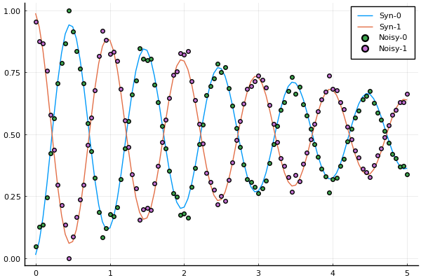
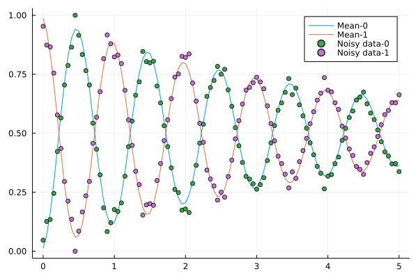

## Example 3: uncertainty quantification for a single qubit based on noisy data of a Ramsey experiment.
In this example, we apply the Metropolis-Hastings algorithm to do uncertainty quantification for a single qubit based on noisy synthetic data of a Ramsey experiment.
We provide an interface to the Julia Bayesian inference  package [Turing.jl](https://turing.ml/stable/).
It can be executed by `cd("examples");include("SingleQubitBayesian.jl")`.

#### Load the needed packages
```julia
using LinearAlgebra
using Turing, Distributions, DifferentialEquations
# Import MCMCChain, Plots, and StatsPlots for visualizations and diagnostics.
using MCMCChains, Plots, StatsPlots
using CSV,DataFrames
# Set a seed for reproducibility.
using Random
Random.seed!(14);
using Plots
include("../src/GLOQ.jl")
pyplot()
```
### Step 1: generate the synthetic data
#### Define the system parameters and the initial state vector.
```julia
N_states = 2; # number of states
freqs = [4.1] # transition frequency in GHz
omegas = 2.0*pi.*freqs # change to angular frequency
gamma1   = [25e-05] # decay
gamma2   = [25e-05] # dephasing
omr = 2.0*pi*(4.1 - 1.0e-3) # drive frequency
TC = 2.5*17.0 # total control time

# Initial state
initial_state = 0
rho_u0 = [0.0;0.0]
rho_v0 = [0.0;0.0]
rho_u0[initial_state+1] = 1.0


```
#### Use forward solve to generate the synthetic data of the Ramsey experiment.
Set up the experiment.
```julia
# Duration of the Ramsey experiment, largest dark time
T_Ramsey = 5.0*GLOQ.GLOQ_MICRO_SEC # convert micro-sec to nano-sec
# total number of dark time samples
N_dark_times = 101
t_dark_times = collect(range(0.0, T_Ramsey, length=N_dark_times))
```
Use `GLOQ.RamseyForwardSolve` to generate the data, and then obtain the corresponding population.
```julia
rho_synthetic_ramsey_u,rho_synthetic_ramsey_v = GLOQ.RamseyForwardSolve(
				 rho_u0,rho_v0, # initial values, u for the real part, v for the imaginary part
			     omegas,omr, # transition frequencies, drive frequency
				 gamma1,gamma2, # decay and dephasing parameters 
				 initial_state, # initial state
				 TC,t_dark_times,N_states) # control time, dark time, total number of states
population_synthetic = GLOQ.get_population(rho_synthetic_ramsey_u)
```
#### Add multiplicative and additive noise to the generated synthetic data.
```julia
noisy_data = copy(population_synthetic)
multiplicative_noise = 1.0.+0.05*randn(N_dark_times) 
noisy_data .*= multiplicative_noise
additive_noise = 0.05*randn(N_dark_times) 
noisy_data .+= additive_noise
```
#### Normalize the noisy data so that it is a population between [0,1].
```julia
for j = 1:N_states
	shift = minimum(noisy_data[:,j])
	if(shift<0.0)
		noisy_data[:,j] .-= shift
	end
end

for i = 1:N_dark_times
	noisy_data[i,:] ./= sum(noisy_data[i,:])
end
```
#### Plot the noisy data.
```julia
fig = plot(t_dark_times./GLOQ.GLOQ_MICRO_SEC,population_synthetic,
		   label=["Syn-0" "Syn-1"])
scatter!(fig,t_dark_times./GLOQ.GLOQ_MICRO_SEC,noisy_data,
		 label=["Noisy-0" "Noisy-1"])

p_true = [freqs;gamma1;gamma2]
```

#### Synthetic data with and without noise. Population of different states are presented.
- Syn-0: synthetic data without noise for the energy level 0;
- Syn-1: synthetic data without noise for the energy level 1;
- Noisy-0: noisy data for the energy level 0;
- Noisy-1: noisy data for the energy level 1.
### Step 2: use `@model` macro to provide interface to the Turing.jl and apply the MCMC algorithm.
#### Step 2a: use `@model` macro to provide interface to the Turing.jl. Check [the tutorial of Turing.jl](https://turing.ml/dev/docs/using-turing/) for more details. 

Below, $\sigma$ is a hyper parameter, `_freq` and `_gamma2` are the transition frequency and the dephasing parameter $\gamma_2$. These
parameters are sampled based on priori distributions. More specifically,
`_freq ~ truncated(Normal(4.1,1e-4),4.1-5e-4,4.1+5e-4)` means that the random variable `_freq` is sampled based on a truncated normal distribution
whose mean is $4.1$ and standard deviation is $1e-4$, and its range is $[4.1-5e-4,4.1+5e-4]$. $\sigma$ is sampled based on the inverse gamma distribution
and `_gamma2` is sampled based on a truncated normal distribution. 

Based on the sampled parameters, we apply `GLOQ.RamseyForwardSolve` to perform a forward solve, and the noisy data is assumed to obey 
a priori distribution, which is a multivariate-normal distribution whose mean is the forward simulation results and its covariance matrix is $\sigma I$.
```julia
global sample_number
@model function RamseyExperiment(data)
	 # Priori distribution
	σ ~ InverseGamma() # random hyper parameter $\sigma$ obeys an Inverse Gamma distribution.
    _freq ~ truncated(Normal(4.1,1e-4),4.1-5e-4,4.1+5e-4)
    _gamma2 ~ truncated(Normal(25e-05,2.5e-5),20e-5,30e-5)
	# Perform a Forward solve with sampled parameters
	_rho_ramsey_u,_rho_ramsey_v = GLOQ.RamseyForwardSolve(
					 rho_u0,rho_v0, # initial values, u for the real part, v for the imaginary part
				     2.0*pi*[_freq],omr, # transition frequencies, drive frequency
					 gamma1,[_gamma2], # decay and dephasing parameters ?
					 initial_state, # initial state
					 TC,t_dark_times,N_states;
					 method="exponential")
					 #method = Trapezoid()) # control time, dark time, total number of states
	_population_ramsey = GLOQ.get_population(_rho_ramsey_u)
	for i = 1:N_dark_times
        data[i,:] ~ MvNormal(_population_ramsey[i,:], σ)
    end
	global sample_number
	sample_number += 1
	println("Sample ",sample_number," done")
end

model = RamseyExperiment(noisy_data)
```
#### Step 2b: use Turing.jl's `sample` function to apply the Metropolis-Hastings algorithm.

In the `sample` function, the first argument is the target `model` object, the second argument specifies which sampler is applied, and the 
third argument is the length of the chain. Here, we use the standard Metropolis-Hastings sampler with a  diagonal covariance matrix.
```julia
sample_number = 0
chain_size = 35000
@time chain = sample(model, MH(Diagonal([5e-3,5e-3,5e-2])), chain_size)
```
Burn-in length is set up as $5000$ to improve the quality of the chain. We present the chain after burn-in.
```julia
BurnIn = 5000
fig_chain = plot(chain[BurnIn+1:end]);
xticks!(fig_chain[4],[4.099998;4.10;4.1000015],);
display(fig_chain)
display(chain[BurnIn+1:end])
```

#### Sampled Markov chain after burn-in and the corresponding posteriori distribution.

### Step 3: Present the data
#### Step 3a: convert the data to [DataFrame](https://dataframes.juliadata.org/stable/) format and calculate the mean value of the Markov chain
```julia
chain_data = DataFrame(chain[BurnIn+1:end])
freq_mean = mean(chain_data._freq)
gamma2_mean = mean(chain_data._gamma2)
```
#### Generate the Ramsey curve corresponding to the mean value of the chain
```julia
rho_chain_mean_u,rho_chain_mean_v = GLOQ.RamseyForwardSolve(
				 rho_u0,rho_v0, # initial values, u for the real part, v for the imaginary part
				 2.0*pi*[freq_mean],omr, # transition frequencies, drive frequency
				 gamma1,[gamma2_mean], # decay and dephasing parameters ?
				 initial_state, # initial state
				 TC,t_dark_times,N_states;
				 method="exponential")
population_chain_mean = GLOQ.get_population(rho_chain_mean_u)
```
Compare the results with noisy data.
```julia
fig_mean_vs_noisy = plot(t_dark_times./GLOQ.GLOQ_MICRO_SEC,population_chain_mean,
		   		  label=["Mean-0" "Mean-1"])
scatter!(fig_mean_vs_noisy,t_dark_times./GLOQ.GLOQ_MICRO_SEC,noisy_data,
		 label=["Noisy data-0" "Noisy data-1"])
display(fig_mean_vs_noisy)
```

#### The Ramsey curve corresponding to the mean value vs data with noise. Mean-0 and Mean-1: the Ramsey curve corresponding to the mean value of the chain for the energy level 0 and 1. Noisy-0 and Noisy-1: noisy data for the energy level 0 and 1.

Compare the results with noise-free data.
```julia
fig_mean_vs_syn = plot(t_dark_times./GLOQ.GLOQ_MICRO_SEC,population_chain_mean,
				   label=["Mean-0" "Mean-1"])
scatter!(fig_mean_vs_syn,t_dark_times./GLOQ.GLOQ_MICRO_SEC,population_synthetic,
		 label=["Syn-0" "Syn-1"])
display(fig_mean_vs_syn)
```

#### The Ramsey curve corresponding to the mean value vs synthetic data without noise. Mean-0 and Mean-1: the Ramsey curve corresponding to the mean value of the chain for the energy level 0 and 1. Syn-0 and Syn-1: synthetic data without noise for the energy level 0 and 1.

#### Display the difference between the mean value of the chain and the true value
```julia
println( "Error of freqs: ",abs(freq_mean-freqs[1]),
		 " Error of γ₂: ",abs(gamma2_mean-gamma2[1]) )
```
#### Results:
```
Error of freqs: 3.7845511347001093e-7 Error of γ₂: 8.2938489833124e-7
```
#### Sample from the Markov chain and perform forward solves, then we compare the sampled results with the noisy data and the forward solve with parameters corresponding to the mean value of the chain.
```julia
global fig_result
for i = 1:1000
	global fig_result
	sample_ind = rand(1:chain_size-BurnIn)
    freq_sample = chain_data._freq[sample_ind]
    gamma2_sample = chain_data._gamma2[sample_ind]
    rho_sample_u,rho_sample_v = GLOQ.RamseyForwardSolve(
				 rho_u0,rho_v0, # initial values, u for the real part, v for the imaginary part
				 2.0*pi*[freq_sample],omr, # transition frequencies, drive frequency
				 gamma1,[gamma2_sample], # decay and dephasing parameters 
				 initial_state, # initial state
				 TC,t_dark_times,N_states;
				 method="exponential")
    population_sample = GLOQ.get_population(rho_sample_u)
	if (i==1)
    	fig_result=plot(t_dark_times./GLOQ.GLOQ_MICRO_SEC,population_sample,
              color = "#BBBBBB", label="");
	else
    	plot!(fig_result,t_dark_times./GLOQ.GLOQ_MICRO_SEC,population_sample,
              color = "#BBBBBB", label="");
	end
end
plot!(fig_result,t_dark_times./GLOQ.GLOQ_MICRO_SEC,population_chain_mean,
	  linewidth=1.0,label=["Mean-0" "Mean-1"])
scatter!(fig_result,t_dark_times./GLOQ.GLOQ_MICRO_SEC,noisy_data,
	     label=["Noisy data-0" "Noisy data-1"])
display(fig_result)
```

#### Compare the Ramsey curves generated by the samples from the chain. Mean-0 and Mean-1: the Ramsey curve corresponding to the mean value of the chain for the energy level 0 and 1. Noisy-0 and Noisy-1: noisy synthetic data for the energy level 0 and 1.