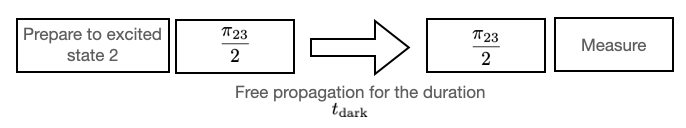
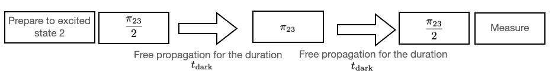
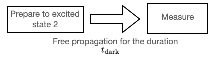

# Experimental Protocols

Here we define some of the experimental protocols we use.

# 1. $\pi$-pulse and $\frac{\pi}{2}$-pulse
1. Pi-pulse: $\pi_{k,k+1}$ is a control pulse that excites the control system from state $k$ to state $k+1$.
1. Half-pi-pulse: $\frac{\pi_{k,k+1}}{2}$ pulse make the system transit halfway from state $k$ to state $k+1$.

# 2. Rabi pulse

The same as the $\pi$-pulse above.

# 3. Ramsey Experiment
The Ramsey experiment is designed to measure the dephasing time $T_2$ and the detuning frequency from state $k$ to state $k+1$. The detuning frequency can then be used to infer the transition frequency.
Its workflow is summarized below.
1. Prepare the system to be in the excited state $k$.
1. Apply the $\pi_{k,k+1}/2$-pulse  but with a detuned frequency.
1. Let the system propagate freely for dark time $t_{\textrm{dark}}$.
1. Apply the $\pi_{k,k+1}/2$-pulse again.
1. Measure the population.

#### A picture to illustrate the procedure of the Ramsey $2$-$3$ experiment.

# 4. $T_2$-echo Experiment
The Echo experiment is a modified version of the Ramsey experiment where a $\pi$ pulse is inserted in the middle of the process to enable refocusing and compensate for different spins. This allows the experiment to gather information about the decoherence that is not refocused by the $\pi$ pulse."[^fn1]
The workflow of the Echo experiment is as follows.
1. Prepare the system to be in excited state $k$.
1. Apply the $\pi_{k,k+1}/2$-pulse.
1. Let the system propagate freely for dark time $t_{\textrm{dark}}$.
1. Apply the $\pi_{k,k+1}$-pule to start the refocusing.
1. Let the system propagate freely for dark time $t_{\textrm{dark}}$.
1. Apply the $\pi_{k,k+1}/2$-pulse again.
1. Measure the population. 

#### A picture to illustrate the procedure of the Echo $2$-$3$ experiment.

# 5. $T_1$-decay Experiment
The $T_1$-decay experiment (also called $T_1$-relaxation experiment) is an experiment designed to measure the $T_1$ relaxation time.
1. Prepare the system to be in excited state $k$.
1. Let the system evolve freely and relax back to the ground state. Measure populations at different times.

#### A picture to illustrate the procedure of the $T_1$-decay experiment.
[^fn1]: Quantum Physics without the Physics, N Anders Petersson, Fortino Garcia, Daniel EA Appelo, Stefanie Günther, Younsoo Choi, Ryan Vogt, arXiv:2012.03865, 2020. 
