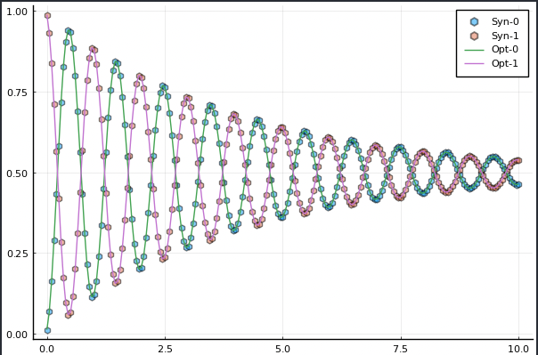

The work flow for solving a quantum characterization problem consists of the following general steps:
1. Setup
2. Optimize

## 1. Setup
The setup phase includes specifying
- Load the experimental/synthetic data
- Specify the known parameters
- Number of the states
- Set up initial guess and the bounds for target parameters
- Create the loss (objective) function by fitting the data set with forward solves
- Optional: compute/approximate the Jacobian of the loss function. By default, auto-differentiation (Zygote.jl) or finite-difference approxiamtion will be used.

## 2. Optimization
- Feed the loss function and its Jacobian to the interface of optimization package.

## 3. Example 1: characterization of the Ramsey experiment with single qudit
### Step 1: generate the synthetic data
```
# System parameters for a simple two level open quantum system
N_states = 2; # number of states
freqs = [4.1] # transition frequency in GHz
omegas = 2.0*pi.*freqs # change to angular frequency
gamma1   = [25e-05] # decay???
gamma2   = [25e-05] # dephasing???
omr = 2.0*pi*(4.1 - 1.0e-3) # drive frequency
TC = 2.5*17.0 # total control time

# Initial state
initial_state = 0
rho_u0 = [0.0;0.0]
rho_v0 = [0.0;0.0]
rho_u0[initial_state+1] = 1.0

# Duration of the Ramsey experiment, largest dark time
T_Ramsey = 10.0*GLOQ.GLOQ_MICRO_SEC # convert micro-sec to nano-sec
# total number of dark time samples
N_dark_times = 201
t_dark_times = collect(range(0.0, T_Ramsey, length=N_dark_times))

# Forward solve to generate synthetic data
rho_synthetic_ramsey_u,rho_synthetic_ramsey_v = GLOQ.RamseyForwardSolve(
				 rho_u0,rho_v0, # initial values, u for the real part, v for the imaginary part
			   omegas,omr, # transition frequencies, drive frequency
				 gamma1,gamma2, # decay and dephasing parameters
				 initial_state, # initial state
				 TC,t_dark_times,N_states) # control time, dark time, total number of states
population_synthetic = GLOQ.get_population(rho_synthetic_ramsey_u)
```
### Step 2: define the loss (objective) function, initial guess and optimization bounds
#### Step 2a: define the loss (objective) function. Here, we use the normalized l2-mismatch.
```
function loss(p,dummy_parameter)
	# forward solve for Ramsey experiment
	_rho_ramsey_u,_rho_ramsey_v = GLOQ.RamseyForwardSolve(
		rho_u0,rho_v0,
		(2*pi).*[p[1]],omr,
		[p[2]],[p[3]],#gamma1,gamma2,
		initial_state, # initial state
		TC,t_dark_times,N_states)
	_population_ramsey = GLOQ.get_population(_rho_ramsey_u)

	# compute the mismatch with synthetic data in l2 sense
	_loss = sum(abs2,_population_ramsey-population_synthetic)/N_dark_times
	return _loss
end
```
#### Step 2b: define a callback function to plot while optimizing
```
plot_callback = function(p,other_args)
	rho_ramsey_u,rho_ramsey_v = GLOQ.RamseyForwardSolve(
		rho_u0,rho_v0,
		(2*pi).*[p[1]],omr,
		[p[2]],[p[3]],#gamma1,gamma2,
		initial_state, # initial state
		TC,t_dark_times,N_states)
		population_ramsey = GLOQ.get_population(rho_ramsey_u)
	fig=plot(t_dark_times./GLOQ.GLOQ_MICRO_SEC,population_synthetic,label=["Syn-0" "Syn-1"],
	line = (:dash,0.0), marker = ([:hex :hex], 5, 0.5)  )
	plot!(fig,t_dark_times./GLOQ.GLOQ_MICRO_SEC,population_ramsey,label=["Opt-0" "Opt-1"])			
	display(fig)
	return false
end
```
#### Step 2c: define a callback function to plot while optimizing
```
p_true = [freqs;gamma1;gamma2] # values to generate synthetic data
# initial guess for the optimization
p_initial = [freqs.-1e-4;0.9.*gamma1;0.9.*gamma2]
# bounds for the optimization
lower_bound = (0.5).*p_true
upper_bound = (1.5).*p_true
```
### Step 3: solve the optimization problem
#### Step 3a: define the optimization object (objective function and its gradient)
```
#  GalacticOptim.OptimizationFunction( objective function, how to compute the gradient ).
#  Here, we use auto-differentiation with Zygoe to compute the gradient
loss_gradient = GalacticOptim.OptimizationFunction(loss, GalacticOptim.AutoZygote())
opt_prob = GalacticOptim.OptimizationProblem(loss_gradient, p_initial,
	lb = lower_bound, ub = upper_bound)
```
#### Step 3b: solve the optimization problem with the Optim interface of GalacticOptim
```
println("Optim Fminbox(LBFGS) Optimization starts")
@time sol = GalacticOptim.solve(opt_prob ,Fminbox(LBFGS()),
	cb = plot_callback, # call back
	outer_iterations = 20, # outer iteration number for Optim's fminbox
	iterations = 10, # inner iteration number for Optim's fminbox
	show_trace=true, # verbose, present optimization infos or not
	f_tol = 1e-3,
	outer_f_tol = 1e-3)
println("Optim Fminbox(LBFGS) Optimization done")
```
#### Step 3c: presnet the result
```
# present the solutions
# present the solutions
println("\nOptimized results: ",sol.u,
	"\nLoss: ",sol.minimum,
	"\nError: ",sol.u-p_true)
```
#### Compare optimized results and the synthetic data.

